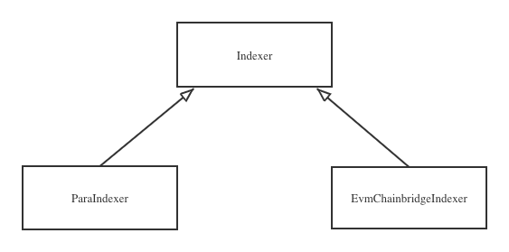

# Indexer

## Classes



```typescript
import {Option, Count, SendingHistory, RecevingHistory} from './types'

export abstract class Indexer {
  /**
   * Account value should be either a 32 bytes substrate-compitable public key * or a 20 bytes Ethereum-like account address.
   */
  public account: string
  public network: string

  constructor(account: string, network: string) {
    if (this.verifyAccount() === false || this.verifyNetwork() === false) {
      throw new Error('Account or network verify failed')
    }
    this.account = account
    this.network = network.toLocaleLowerCase()
  }

  abstract verifyAccount(): boolean
  abstract verifyNetwork(): boolean
  abstract sendingCount(): Promise<Option<Count>>
  abstract sendingHistory(): Promise<Option<SendingHistory[]>>
  abstract limittedSendingHistory(
    limit: number
  ): Promise<Option<SendingHistory[]>>
  abstract rangeSendingHistory(
    from: number,
    to: number
  ): Promise<Option<SendingHistory[]>>

  abstract recevingCount(): Promise<Option<Count>>
  abstract recevingHistory(): Promise<Option<RecevingHistory[]>>
  abstract limittedRecevingHistory(
    limit: number
  ): Promise<Option<RecevingHistory[]>>
  abstract rangeRecevingHistory(
    from: number,
    to: number
  ): Promise<Option<RecevingHistory[]>>
}
```

## MultiAsset & MultiLocation

Head to **@polkadot.js/types** see the definition of [MultiAsset](https://github.com/polkadot-js/api/blob/a2ff40f735aadcc2733e9b926f564abe4e652c96/packages/types/src/interfaces/xcm/types.ts#L346) and [MultiLocation](https://github.com/polkadot-js/api/blob/a2ff40f735aadcc2733e9b926f564abe4e652c96/packages/types/src/interfaces/xcm/types.ts#L419).

## Tx

```typescript
interface Tx {
  readonly sender: string
  readonly hash: string
}
```

## Sending count & receving count

```typescript
interface Count {
  readonly account: string
  readonly count: string
}
```

## Crosschain transaction status

```typescript
enum Status {
  Sent,
  Forwarded,
  Confirmed,
  Failed,
}
```

## Sending history

```typescript
interface SendingHistory {
  readonly createdAt: string
  readonly isXcm: boolean
  readonly xcmSendingData?: XCMSendingData
  readonly isChainbridge: boolean
  readonly chainbridgeSendingData?: ChainbridgeSendingData
  readonly status: string
}

interface XCMSendingData {
  readonly id: string
  readonly asset: MultiAsset
  readonly recipient: string
  readonly amount: string
  readonly index: number
  readonly sendTx: Tx
  readonly sender: string
}

interface ChainbridgeSendingData {
  readonly id: string
  readonly destChainId: number
  readonly depositNonce: number
  readonly resourceId: string
  readonly amount: string
  readonly recipient: string
  readonly index: number
  readonly sendTx: Tx
  readonly sender: string
}
```

## Receving history

```typescript
interface RecevingHistory {
  readonly createdAt: string
  readonly isXcm: boolean
  readonly xcmSendingData?: XCMRecevingData
  readonly isChainbridge: boolean
  readonly chainbridgeRecevingData?: ChainbridgeRecevingData
}

interface XCMRecevingData {
  readonly id: string
  readonly asset: MultiAsset
  readonly amount: string
  readonly account: string
  readonly index: number
}

export interface ChainbridgeConfirmData {
  readonly id: string
  readonly originChainId: number
  readonly depositNonce: number
  readonly status: string
  readonly executeTx: Tx
}
```
